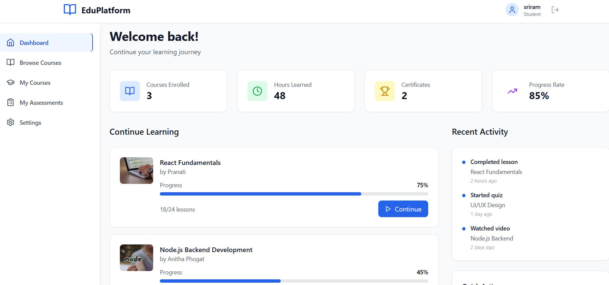

# Learning Management System (LMS) Frontend

A modern, responsive Learning Management System built with React, TypeScript, and Tailwind CSS, designed to work with a MongoDB backend.
---
## Live Demo - https://lms-platform-wine-psi.vercel.app/


---
## Features

- **User Authentication & Roles**: JWT-based authentication with Admin, Instructor, and Student roles
- **Course Management**: Complete CRUD operations for courses with multimedia support
- **Assessments & Quizzes**: Interactive assessments with auto-scoring and progress tracking
- **Analytics Dashboard**: Real-time statistics and progress tracking with Chart.js
- **Responsive Design**: Mobile-first design that works on all devices
- **Role-based Access Control**: Different interfaces and permissions for each user role
---
## Tech Stack

- **Frontend**: React 18, TypeScript, Tailwind CSS
- **Charts**: Chart.js with React Chart.js 2
- **Icons**: Lucide React
- **Routing**: React Router DOM
- **Build Tool**: Vite
- **Backend**: Designed for MongoDB with Express.js APIs
---
## Getting Started

### Prerequisites

- Node.js 18+ and npm
- MongoDB backend server running (see backend setup instructions)

### Installation

1. Clone the repository:
```bash
git clone <repository-url>
cd lms-frontend
```

2. Install dependencies:
```bash
npm install
```

3. Set up environment variables:
```bash
cp .env.example .env.local
```

4. Update the API URL in `.env.local`:
```
VITE_API_URL=http://localhost:5000/api
```

5. Start the development server:
```bash
npm run dev
```

The application will be available at `http://localhost:5173`
---
## Deployment

### Vercel Deployment

1. Install Vercel CLI:
```bash
npm i -g vercel
```

2. Set environment variables in Vercel dashboard:
```
VITE_API_URL=https://your-backend-url.com/api   
---
```


## Project Structure

```
backend/
src/
├── components/          # React components
│   ├── Auth/           # Authentication components
│   ├── Dashboard/      # Dashboard components for each role
│   ├── Courses/        # Course-related components
│   ├── Assessments/    # Assessment and quiz components
│   └── Layout/         # Layout components
├── contexts/           # React contexts
├── hooks/              # Custom React hooks
├── lib/                # API utilities
├── types/              # TypeScript type definitions
└── App.tsx             # Main application component
```
---
## User Roles & Features

### Student
- Browse and enroll in courses
- View course materials and progress
- Take assessments and quizzes
- Track learning progress
- View grades and certificates

### Instructor
- Create and manage courses
- Upload course materials (videos, documents)
- Create assessments and quizzes
- View student progress and grades
- Manage course enrollments

### Admin
- Manage all users and courses
- View platform analytics
- System configuration
- User role management
- Platform statistics and reports
---

## License

This project is licensed under the MIT License.

Contact-
sriramchaitu383@gmail.com